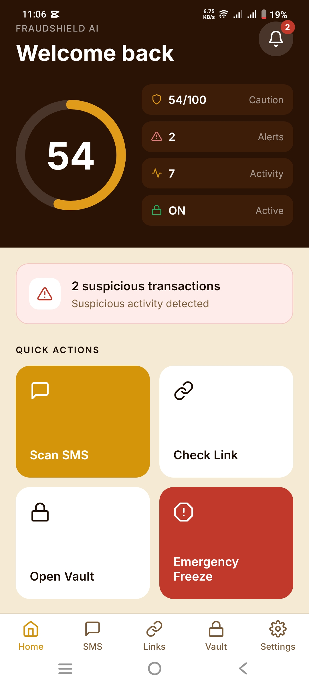
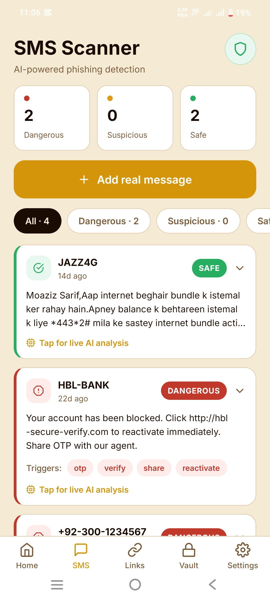
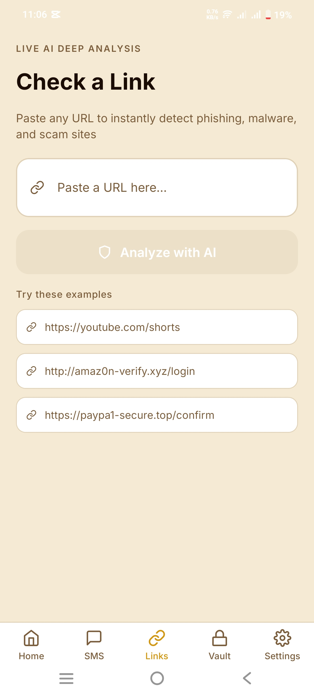
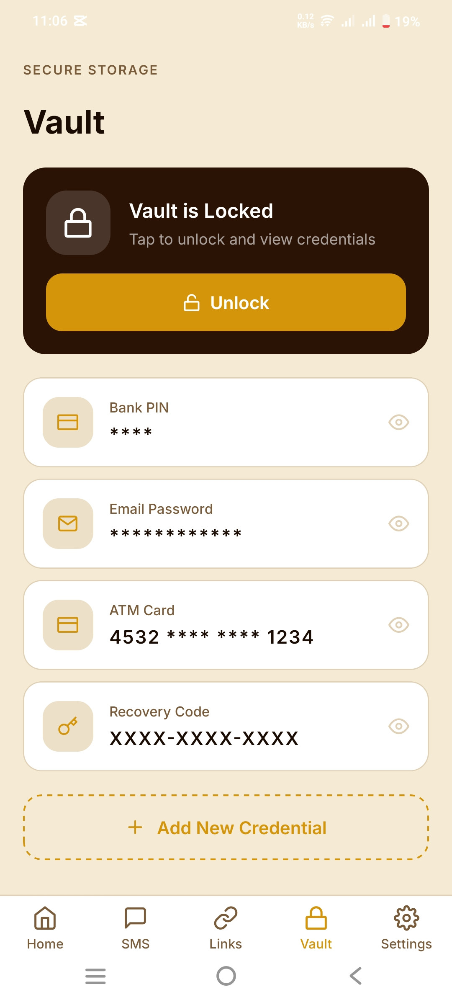
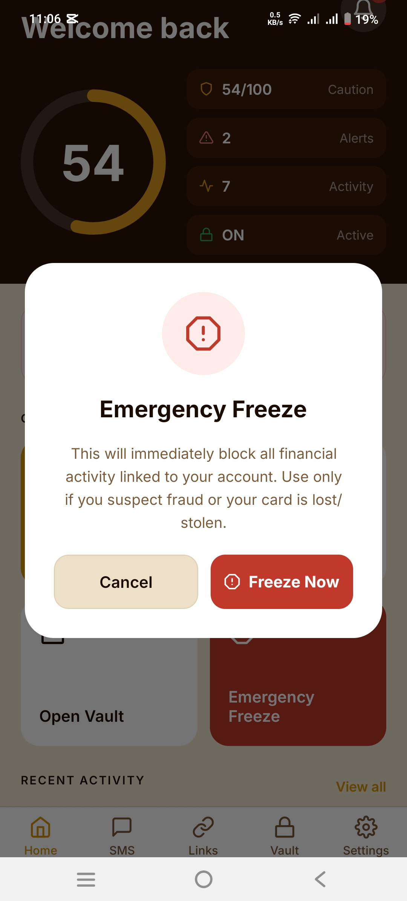
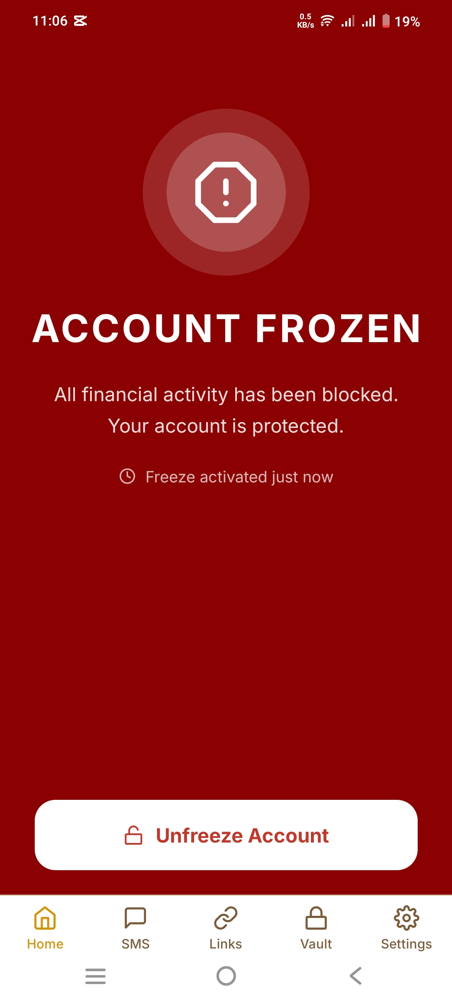
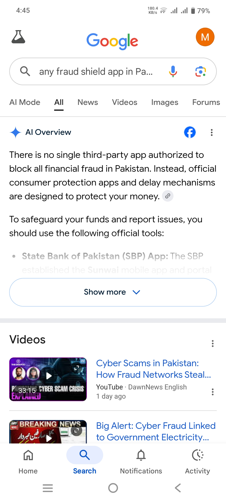
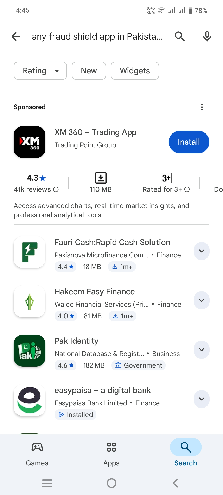

# 🛡️ FraudShield AI

> AI-Powered Fraud Detection Mobile App — Protecting Pakistani banking users from financial scams, phishing SMS, and suspicious links.

> ⚠️ **How to open Live Demo:**
> - **Mobile:** Install [Expo Go](https://play.google.com/store/apps/details?id=host.exp.exponent) app → Open app → Enter URL: `exp://fraud-shield--moeenhaider12.replit.app`
> - **Browser:** Open `https://fraud-shield--moeenhaider12.replit.app`

---

## 🖼️ App Screenshots

| Home Screen | SMS Scanner | Link Checker |
|:---:|:---:|:---:|
|  |  |  |

| Secure Vault | Emergency Freeze | Account Frozen | Settings |
|:---:|:---:|:---:|:---:|
|  |  |  |  |

---

## 🎬 Demo Video

---

## 📲 Download APK

> **Installation:** Download APK → Open file → Allow unknown sources → Install → Run

---

## ✨ Features

- 🏠 **Home Dashboard** — Security score (0–100), alerts, activity overview, and quick action buttons
- 📩 **SMS Scanner** — AI-powered phishing detection, classifies messages as Safe, Suspicious, or Dangerous
- 🔗 **Link Checker** — Paste any URL to instantly detect phishing, malware, and scam sites
- 🔐 **Secure Vault** — Biometric-protected storage for Bank PIN, ATM Card, Email Password, and Recovery Codes
- 🚨 **Emergency Freeze** — Instantly block all financial activity if fraud is suspected or card is lost/stolen
- ⚙️ **Settings** — SMS Monitoring, Auto-Scan Links, Fraud Alerts, Biometric Lock, Dark Mode, Language (EN/اردو)

---

## 🛠️ Tech Stack

| Layer | Technology |
|-------|-----------|
| Mobile App | React Native + Expo (SDK 54) |
| Navigation | Expo Router (file-based) |
| Backend | Express 5 + Node.js 24 |
| AI | OpenAI GPT (gpt-5-mini) |
| Database | PostgreSQL + Drizzle ORM |
| Validation | Zod v4 + drizzle-zod |
| Auth | expo-local-authentication (Face ID / Fingerprint) |
| Storage | expo-secure-store + AsyncStorage |
| Package Manager | pnpm workspaces (monorepo) |
| Language | TypeScript 5.9 |

---

## 🚀 How to Install APK

1. Click **Download APK** button above
2. Open the APK file on your Android phone
3. Tap **"Allow from this source"** if prompted
4. Tap **"Install"** and wait
5. Open **FraudShield AI** from home screen

---

## 🧠 Fraud Detection Logic

### 1. Rule-Based (Offline, Instant)
- **SMS:** Scans for phishing keywords (`otp`, `verify`, `account blocked`, `lucky draw`)
- **Links:** Detects suspicious TLDs (`.tk`, `.ml`, `.xyz`), URL shorteners, raw IP addresses

### 2. AI-Powered (via OpenAI)
- Deep contextual analysis for complex cases
- Supports **English** and **Urdu** responses
- Returns verdict with specific reasons and recommendations

---

## 🔒 Security Features

- Biometric authentication (Face ID / Fingerprint / Device PIN)
- Encrypted secure storage for vault items
- Emergency account freeze with one tap
- Background fraud monitoring with push notifications

---

## 📱 Android Permissions

| Permission | Purpose |
|---|---|
| `RECEIVE_SMS, READ_SMS` | For SMS scanning |
| `INTERNET` | For AI-powered analysis |
| `POST_NOTIFICATIONS` | For fraud alerts |
| `FOREGROUND_SERVICE` | For background monitoring |
| `RECEIVE_BOOT_COMPLETED` | For auto-start on device boot |

---

## 📄 Documentation

- 📘 [User Manual](user_manual.pdf)
- 📜 [License](LICENSE.txt)

---

## 🔮 Future Enhancements

- Add more fraud detection patterns
- Improve UI design
- Add admin panel
- Add database reports
- Multi-language support expansion

---

## 👨‍💻 Developed By

**Student Name:** Syed Moeen Haider
**GitHub:** [syedMoeenhaider](https://github.com/syedMoeenhaider)

---

## 📄 License

MIT License — see the [LICENSE.txt](LICENSE.txt) file for details.

---

  <b>🛡️ FraudShield AI — Protecting Your Financial Future</b>

---

## 🇵🇰 Why FraudShield AI is Unique in Pakistan?

> **Pakistan mein aaj tak koi dedicated AI-powered fraud detection mobile app available nahi thi — FraudShield AI is the FIRST of its kind!**

### 🔍 Market Research Proof

We searched Google and Play Store for any similar fraud detection app in Pakistan — **nothing was found:**

**Google Search Result:**
> *"There is no single third-party app authorized to block all financial fraud in Pakistan"*

**Play Store Search Result:**
> *No dedicated fraud shield app exists for Pakistani users on Play Store*

### 💡 What Makes Us Different?

| Feature | Other Apps | FraudShield AI |
|---|---|---|
| AI-Powered SMS Detection | ❌ | ✅ |
| Urdu Language Support | ❌ | ✅ |
| Pakistani Bank Phishing Detection | ❌ | ✅ |
| Real-time Link Scanner | ❌ | ✅ |
| Emergency Account Freeze | ❌ | ✅ |
| Secure Credential Vault | ❌ | ✅ |
| Built for Pakistani Users | ❌ | ✅ |

> 🏆 **FraudShield AI fills a critical gap in Pakistan's digital security ecosystem — protecting millions of banking users who had NO dedicated protection tool before this app.**

---
